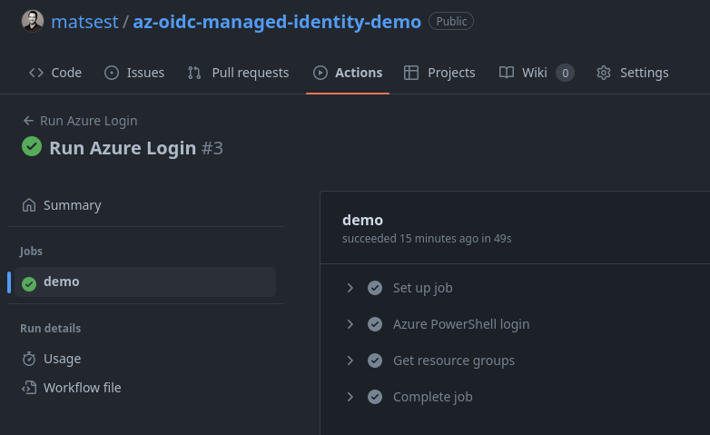

# GitHub Actions with federated credentials to user-assigned managed identity

Demo project to test the viability of using user-assigned managed identites instead of service principals for authentication for GitHub Actions.

## Motivation

- Use managed identities in GitHub Actions? ❓
- Managed identities can't have secrets as credentials 🔒
- Managed identities can be created declaratively with Bicep / via resource manager API 😎
- Federated credentials allows for more granular restrictions on the identity's use (e.g. specific repos, branches and environments) ✅
- Avoid issues with short-lived tokens for federated credentials on service principals (1hr vs 24hrs when using managed identities, for long running jobs) 🕥

## Prerequisites

- [PowerShell 7](https://learn.microsoft.com/en-us/powershell/scripting/install/installing-powershell)
- [Azure PowerShell module](https://docs.microsoft.com/en-us/powershell/azure/install-az-ps) (9.0+)
- Bicep (install with `az bicep install` or upgrade with `az bicep upgrade`) (0.12+)
- An Azure subscription with Contributor permissions

## Steps

1. [Fork this repo](https://github.com/matsest/az-oidc-managed-identity-demo/fork)

2. Open PowerShell and run this deployment locally:

```powershell
Connect-AzAccount

$ghUserName = '<your github user name>'

New-AzSubscriptionDeployment -Name "demo-mi-gh" -Location norwayeast `
    -TemplateFile ./bicep/main.bicep -ghUserName $ghUserName
```

This will deploy the [main.bicep](./bicep/main.bicep) that contains a resource group with a managed identity with a federated credential and a role assignment. Make note of the output values for subscription id, client id and tenant id.

3. Add these values as secrets to your GitHub repository with the secret names `SUBSCRIPTION_ID`, `CLIENT_ID`, `TENANT_ID`.

4. Trigger the GitHub Actions workflow by navigating to [Actions](/actions) and choosing the "Run Azure Login" workflow. View the details of the 'demo' job in the workflow and inspect the steps.

This will demonstrate that the workflow is able to login with the managed identity using federated credentials and it will list the resource groups it has access to! ✅



## Summary

1. You have deployed a managed identity and federated credentials declaratively using Bicep - without any Azure AD or Graph-related tasks.
1. You've authenticated from GitHub to Azure in a GitHub Actions workflow using a managed identity to do this instead of a service principal - which means no secrets to manage!
1. You are logging in using a federated credential for the managed identity _specifically scoped_ to your GitHub repository (and environment) to authenticate. This means there's no method this credential can be used to login from other sources.
1. The managed identity is authorized in Azure to a specific scope (Contributor on the resource group in this case). This is default behaviour for identities in Azure.

## Cleanup

Delete the resource group including the managed identity and its credentials by running:

```powershell
Remove-AzResourceGroup -Name "demo-mi-gh-rg"
```

## Learn more

- [Workload Identity Federation](https://learn.microsoft.com/en-us/azure/active-directory/develop/workload-identity-federation)
- [Configure a user-assigned managed identity to trust an external identity provider ](https://learn.microsoft.com/en-us/azure/active-directory/develop/workload-identity-federation-create-trust-user-assigned-managed-identity?pivots=identity-wif-mi-methods-azp)
- [Manage user-assigned managed identities](https://learn.microsoft.com/en-us/azure/active-directory/managed-identities-azure-resources/how-manage-user-assigned-managed-identities?pivots=identity-mi-methods-powershell)
